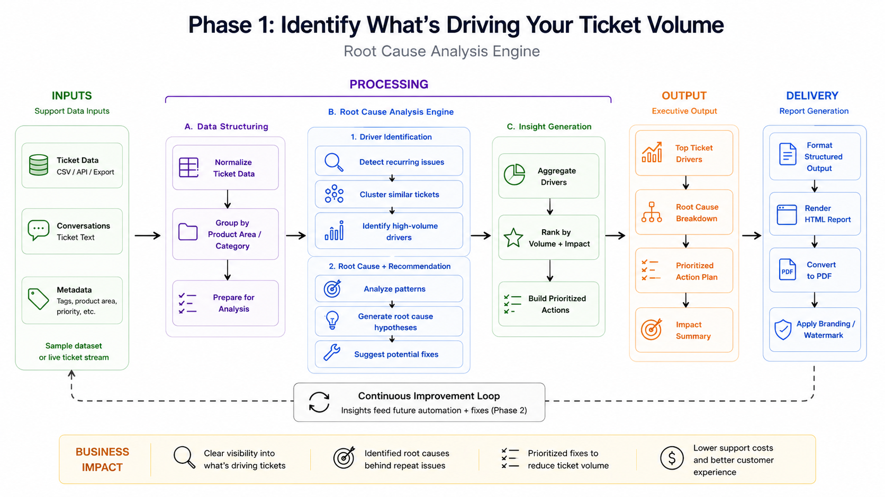
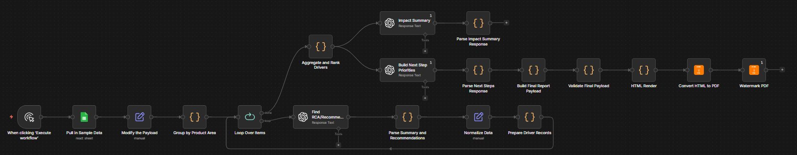

# Case Study: Identifying What’s Driving Support Ticket Volume (Phase 1)

A Root Cause Analysis (RCA) system built with **n8n** and **OpenAI** that transforms support ticket data into **clear insight on what’s driving ticket volume—and what to fix next**.

---

## Overview

Support teams don’t just need to resolve tickets — they need to understand:

- What’s driving ticket volume  
- Why issues are happening repeatedly  
- Where to focus to reduce demand  

In most organizations:

- RCA is manual or inconsistent  
- Teams optimize handling, not elimination  
- Insights are disconnected from action  
- Leadership lacks clear direction on what to fix  

This case study demonstrates how to:

> **Identify what’s driving support demand—and where to reduce it.**

---

## Architecture

This system is built as a **structured RCA pipeline**:

1. **Data Structuring**
2. **Driver Identification**
3. **Root Cause Analysis**
4. **Insight Generation**
5. **Executive Output**

---

## Problem

Support organizations struggle to reduce ticket volume because:

- High ticket volume makes analysis difficult  
- Root causes are not clearly identified  
- Teams lack prioritization on what to fix  
- The same issues generate repeat tickets  

As a result:

> Teams get faster—but ticket volume doesn’t go down.

---

## Solution

This workflow introduces a **Root Cause Analysis Engine** that:

- Analyzes support ticket data at scale  
- Identifies recurring high-volume drivers  
- Groups issues into root cause themes  
- Prioritizes where to focus based on impact  

Instead of optimizing how tickets are handled, this approach focuses on:

> **Eliminating why tickets happen in the first place.**

---

## What This Workflow Does

- Processes structured ticket data  
- Identifies recurring issues and patterns  
- Groups issues into high-volume drivers  
- Generates root cause hypotheses  
- Aggregates and ranks drivers by impact  
- Produces a prioritized action plan  
- Outputs an executive-ready summary  

---

## How It Works

### 1. Data Ingestion

- Source: Sample support dataset  
- Includes:
  - Ticket metadata (tags, product area, priority)
  - Ticket descriptions and conversations  

---

### 2. Data Structuring

- Normalizes ticket data  
- Groups tickets by product area and category  
- Prepares dataset for analysis  

---

### 3. Driver Identification

- Detects recurring issues  
- Clusters similar tickets  
- Identifies high-volume drivers  

---

### 4. Root Cause Analysis

- Analyzes patterns behind drivers  
- Generates root cause hypotheses  
- Suggests potential areas for improvement  

---

### 5. Insight Generation

- Aggregates drivers  
- Ranks by volume and impact  
- Builds prioritized action opportunities  

---

### 6. Executive Output

Generates structured outputs including:

- Top ticket drivers  
- Root cause breakdown  
- Prioritized action plan  
- Impact summary  

---

## Example Outputs

### RCA Workflow

---

### Final RCA Report

- Full analysis included in:  
  `Final RCA Summary Deliverable - Phase 1.pdf`

This report includes:

- Top 10 ticket drivers  
- Root cause breakdown by category  
- Prioritized actions  
- Impact summary  

---

## Key Insight

A small number of repeat issues drive a disproportionate share of support demand.

> In this dataset, the top 3 drivers account for ~25% of total ticket volume.

This represents a clear opportunity to reduce demand at the source.

---

## Expected Impact

If the highest-volume drivers are addressed:

- ~20–30% reduction in ticket volume  
- Significant decrease in repetitive support work  
- Lower support costs without additional hiring  
- Improved customer experience  

---

## What Happens Next

This analysis highlights exactly where to focus:

- Authentication errors (highest-volume driver)  
- Performance issues impacting usability  
- Connectivity issues affecting reliability  

These represent clear opportunities to reduce ticket volume through:

- Product improvements  
- Workflow changes  
- Targeted automation  

In the next phase, these drivers can be addressed and measured to validate impact.

---

## Why This Matters

Most teams focus on:

- SLAs  
- Response times  
- Agent efficiency  

But:

> Support doesn’t scale by handling tickets faster.  
> It scales by eliminating the need for them.

---

## Tech Stack

- **n8n** (workflow orchestration)  
- **OpenAI API** (pattern detection + reasoning)  
- **Structured dataset (CSV/Excel)**  
- HTML → PDF rendering for report generation  

---

## Files Included

- `Case Study Prompt.docx` → Case study narrative  
- `Final RCA Summary Deliverable - Phase 1.pdf` → Output report  
- `architecture-flow.png` → System architecture  
- `process-flow.png` → Workflow visualization  

---

## Case Study Series

This project is part of a broader portfolio focused on:

- Support Operations  
- AI-driven automation  
- Reducing support demand at the source  

Future case studies will demonstrate:

- Implementing fixes for high-volume drivers (Phase 2)  
- Measuring impact and reduction in ticket volume  
- Scaling improvements across support organizations  

---

## Author

Built by Jesse Snow  
Focused on **Support Operations, AI Automation, and Scalable Systems Design**

---
